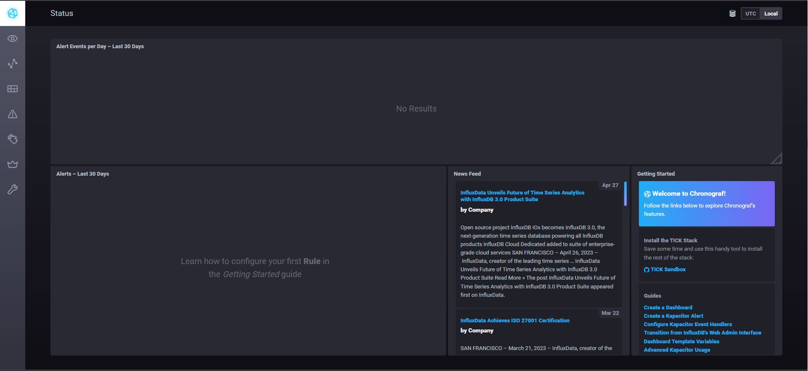
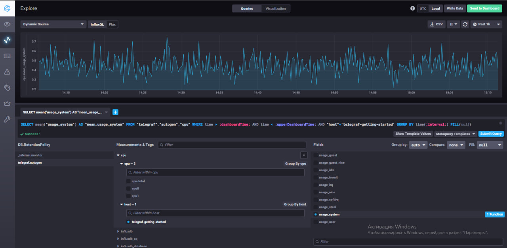
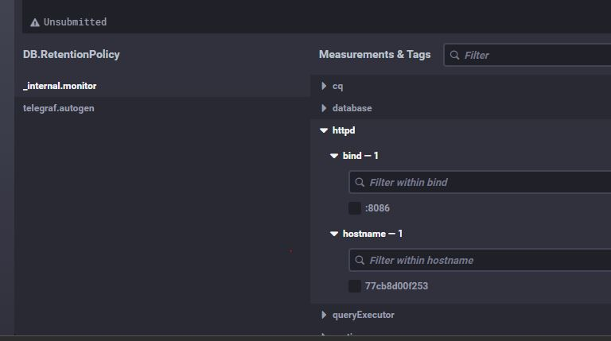

# Домашнее задание к занятию "13.Системы мониторинга"

## Обязательные задания

1. Вас пригласили настроить мониторинг на проект. На онбординге вам рассказали, что проект представляет из себя 
платформу для вычислений с выдачей текстовых отчетов, которые сохраняются на диск. Взаимодействие с платформой 
осуществляется по протоколу http. Также вам отметили, что вычисления загружают ЦПУ. Какой минимальный набор метрик вы
выведите в мониторинг и почему?

Ответы:

1. Загрузка ЦПУ (CPU utilization): Эта метрика позволяет контролировать использование ресурсов ЦПУ и определить, насколько интенсивно происходят вычисления. Высокая загрузка ЦПУ может указывать на проблемы с производительностью и может потребоваться оптимизация кода или добавление вычислительных ресурсов.

2. Память (Memory usage): Мониторинг использования памяти важен для определения потребностей платформы в ресурсах. Высокое использование памяти может указывать на утечки памяти или неэффективное использование ресурсов, что может привести к проблемам производительности.

3. Загрузка сети (Network utilization): Эта метрика позволяет отслеживать объем сетевого трафика, связанного с обработкой запросов и передачей данных. Высокая загрузка сети может указывать на проблемы с пропускной способностью или наличие узких мест в инфраструктуре.

4. Количество запросов (Request count): Мониторинг количества запросов позволяет оценить нагрузку на платформу и выявить пиковые нагрузки. Это может помочь в оптимизации ресурсов и настройке масштабирования, чтобы обеспечить требуемую производительность.

5. Ответное время (Response time): Измерение времени отклика платформы позволяет оценить производительность и реагировать на возможные задержки. Эта метрика может помочь в выявлении узких мест и оптимизации процессов.

6. Объем сохраненных отчетов (Report storage): Мониторинг объема сохраненных отчетов поможет отслеживать рост данных и планировать периодическую очистку или масштабирование хранилища.

#
2. Менеджер продукта посмотрев на ваши метрики сказал, что ему непонятно что такое RAM/inodes/CPUla. Также он сказал, 
что хочет понимать, насколько мы выполняем свои обязанности перед клиентами и какое качество обслуживания. Что вы 
можете ему предложить?

Ответы:

1. Время отклика (Response time): Это время, за которое платформа отвечает на запросы клиентов. Меньшее время отклика обычно свидетельствует о более высоком качестве обслуживания. Метрика может быть измерена в среднем или в процентилях (например, 95-й процентиль).

2. Доступность (Uptime): Метрика, отображающая доступность платформы для клиентов в течение определенного периода времени. Высокая доступность (например, 99,9%) указывает на надежность и отличное качество обслуживания.

3. Количество ошибок (Error rate): Эта метрика позволяет отслеживать процент ошибок или неудачных запросов, полученных от клиентов. Меньшее количество ошибок свидетельствует о высоком качестве и надежности обслуживания.

4. Время восстановления (Recovery time): Эта метрика показывает время, необходимое для восстановления платформы после сбоев или проблем. Быстрое восстановление указывает на высокую отзывчивость команды поддержки и качество обслуживания.

5. Уровень удовлетворенности клиентов (Customer satisfaction): Можно собирать обратную связь от клиентов, например, с помощью опросов или оценок. Это поможет понять, насколько клиенты довольны предоставляемыми услугами и какие улучшения могут быть внесены.

6. Время решения проблем (Issue resolution time): Метрика, отображающая время, которое требуется для разрешения проблем клиентов. Минимизация времени решения проблем позволит улучшить обслуживание и повысить удовлетворенность клиентов.

7. Количество обращений клиентов (Customer support tickets): Метрика, отображающая количество обращений клиентов за поддержкой или помощью. Можно анализировать тренды и изменения в количестве обращений, чтобы определить эффективность обслуживания и потребности клиентов.

#
3. Вашей DevOps команде в этом году не выделили финансирование на построение системы сбора логов. Разработчики в свою 
очередь хотят видеть все ошибки, которые выдают их приложения. Какое решение вы можете предпринять в этой ситуации, 
чтобы разработчики получали ошибки приложения?

Ответы:

1. Логирование в файлы: Разработчики могут использовать механизмы логирования в файлы прямо в своем приложении. При возникновении ошибок, информация о них будет записываться в лог-файлы, которые разработчики могут проверять для выявления проблем.

2. Уведомления по электронной почте: Настройте систему уведомлений, которая будет отправлять электронные письма разработчикам при возникновении ошибок в приложении. Это может быть реализовано с помощью отправки писем с определенными деталями ошибки и трейсбеком.

3. Использование мониторинга ошибок сторонних сервисов: Исследуйте доступные бесплатные или недорогие сервисы мониторинга ошибок, которые позволяют интегрироваться с приложениями и предоставляют информацию о возникающих ошибках. Некоторые из них могут предоставлять бесплатные планы с ограниченными возможностями, которые могут быть полезными для начала.

4. Логирование на уровне приложения: Разработчики могут настроить в своем приложении вывод информации об ошибках на консоль или в другое удобное для них место, где они смогут видеть ошибки и отладочную информацию.

#
4. Вы, как опытный SRE, сделали мониторинг, куда вывели отображения выполнения SLA=99% по http кодам ответов. 
Вычисляете этот параметр по следующей формуле: summ_2xx_requests/summ_all_requests. Данный параметр не поднимается выше 
70%, но при этом в вашей системе нет кодов ответа 5xx и 4xx. Где у вас ошибка?

Ответы:

Это связано с тем, что в данной формуле требуется учитывать только успешные (коды 2xx) запросы, но отсутствие ошибок (кодов 5xx и 4xx) не дает нам информации для расчета. Для правильного расчета параметра SLA=99% по http кодам ответов, необходимо учитывать все типы запросов, включая успешные и неуспешные. В формуле следует использовать суммарное количество успешных запросов (2xx), ошибочных запросов (4xx) и серверных ошибок (5xx). Например, формула может быть следующей: (summ_2xx_requests + summ_4xx_requests + summ_5xx_requests) / summ_all_requests. Таким образом, ошибка возникает в формуле, которая исключает коды ответа 5xx и 4xx из расчета. Для корректного вычисления параметра SLA=99% по http кодам ответов следует использовать формулу, учитывающую все типы запросов.

#
5. Опишите основные плюсы и минусы pull и push систем мониторинга.

Ответы:

Pull-системы мониторинга:
Плюсы:
1. Простота настройки: Pull-системы позволяют агентам или клиентам самостоятельно запрашивать метрики у мониторинговой системы. Это обычно проще в настройке и понимании.
2. Гибкость: Агенты или клиенты могут выбирать, какие метрики они хотят собирать и отправлять. Это позволяет более гибко настроить сбор данных в зависимости от потребностей.
3. Масштабируемость: Pull-системы могут легче масштабироваться для обработки больших объемов данных, так как каждый клиент или агент отдельно запрашивает данные.

Минусы:
1. Задержка: Pull-системы могут иметь некоторую задержку между запросом данных и получением ответа. Это может быть проблематично для мониторинга в реальном времени или при сборе метрик с высокой частотой.
2. Нагрузка на клиентов: Клиентам или агентам приходится самостоятельно запрашивать данные у мониторинговой системы. Это может создавать дополнительную нагрузку на клиентскую инфраструктуру.

Push-системы мониторинга:
Плюсы:
1. Мгновенность: Push-системы позволяют мгновенно отправлять данные мониторинга сразу после сбора. Это особенно полезно для мониторинга в реальном времени или при работе с данными с высокой частотой.
2. Меньшая нагрузка на клиентов: Клиентам или агентам не нужно самостоятельно запрашивать данные, так как они активно отправляются в мониторинговую систему. Это может снизить нагрузку на клиентскую инфраструктуру.

Минусы:
1. Сложность настройки: Push-системы могут быть сложнее в настройке, так как требуется настроить механизмы отправки данных с клиентов или агентов в мониторинговую систему.
2. Ограниченная гибкость: Push-системы могут ограничить гибкость в выборе метрик и данных, которые отправляются. Это может быть ограничено функциональностью клиентской библиотеки или возможностями отправки данных.

Оба подхода имеют свои преимущества и недостатки, и выбор между pull и push системой мониторинга зависит от требований, инфраструктуры и конкретного случая использования.

#
6. Какие из ниже перечисленных систем относятся к push модели, а какие к pull? А может есть гибридные?

    - Prometheus 
    - TICK
    - Zabbix
    - VictoriaMetrics
    - Nagios

Ответы:

PULL
Zabbix
VictoriaMetrics
Nagios

PUSH
Prometheus

HYBRID
TICK

#

7. Ответ:

  

8. Ответ:

  

9. Ответ:

  

