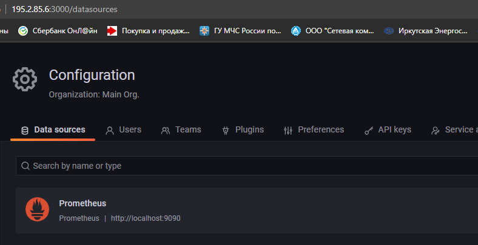
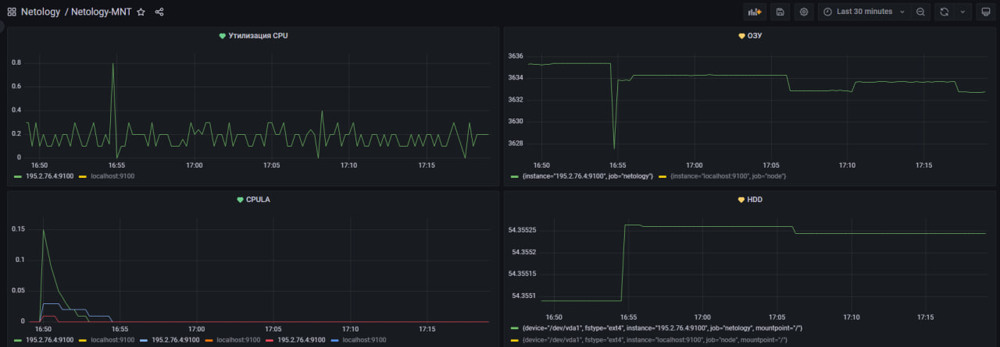

### Задание 1

1. Используя директорию [help](./help) внутри этого домашнего задания, запустите связку prometheus-grafana.
1. Зайдите в веб-интерфейс grafana, используя авторизационные данные, указанные в манифесте docker-compose.
1. Подключите поднятый вами prometheus, как источник данных.
1. Решение домашнего задания — скриншот веб-интерфейса grafana со списком подключенных Datasource.

## Задание 2

Изучите самостоятельно ресурсы:

1. [PromQL tutorial for beginners and humans](https://valyala.medium.com/promql-tutorial-for-beginners-9ab455142085).
1. [Understanding Machine CPU usage](https://www.robustperception.io/understanding-machine-cpu-usage).
1. [Introduction to PromQL, the Prometheus query language](https://grafana.com/blog/2020/02/04/introduction-to-promql-the-prometheus-query-language/).

Создайте Dashboard и в ней создайте Panels:

- утилизация CPU для nodeexporter (в процентах, 100-idle);
- CPULA 1/5/15;
- количество свободной оперативной памяти;
- количество места на файловой системе.

Для решения этого задания приведите promql-запросы для выдачи этих метрик, а также скриншот получившейся Dashboard.

## Задание 3

1. Создайте для каждой Dashboard подходящее правило alert — можно обратиться к первой лекции в блоке «Мониторинг».
1. В качестве решения задания приведите скриншот вашей итоговой Dashboard.

## Задание 4

1. Сохраните ваш Dashboard.Для этого перейдите в настройки Dashboard, выберите в боковом меню «JSON MODEL». Далее скопируйте отображаемое json-содержимое в отдельный файл и сохраните его.
1. В качестве решения задания приведите листинг этого файла.

Ответы:

Скриншот спискуа подключенных Datasource

<p align="center">
  
</p>

Скриншот Dashboard с alert

<p align="center">
  
</p>

1. Утилизация CPU для node exporter (в процентах, 100-idle):

```
100 - avg(irate(node_cpu_seconds_total{mode="idle"}[5m])) by (instance) * 100
```

2. CPULA 1/5/15:

```
avg(node_load1) by (instance)
avg(node_load5) by (instance)
avg(node_load15) by (instance)
```

3. Количество свободной оперативной памяти:

```
node_memory_MemAvailable_bytes / (1024 * 1024)
```

4. Количество места на файловой системе:

```
node_filesystem_avail_bytes{mountpoint="/"} / (1024 * 1024 * 1024)
```

[Листинг Модели](https://github.com/bigorado/monitoring_dz/blob/main/files/model.json)

